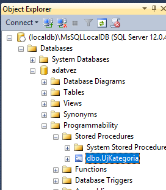

# Microsoft SQL Server használata

A Microsoft SQL Server kiszolgálóhoz az SQL Server Management Studio
szoftverrel kapcsolódunk. A kiszolgáló helyben fut, az un. LocalDB
verziót használjuk, de otthoni használatra megfelel az Express változat
is (bármely verzió).

Letöltési linkek:

- A LocalDB Visual Studio-val települ
- <https://www.microsoft.com/en-us/sql-server/sql-server-editions-express>
- <https://docs.microsoft.com/en-us/sql/ssms/download-sql-server-management-studio-ssms>

## SQL Server Management Studio használata

A tanszéki laborokban a programot a start menüből indíthatjuk. A program
indulása után kapcsolódhatunk az adatbázishoz a felugró ablakban.
LocalDB használata esetén a *Server name* `(localdb)\mssqllocaldb`,
Express Edition használata esetén `.\sqlexpress` (alapbeállításokkal
való telepítés esetén). Mindkét esetben *Windows Authentication*-t
használunk.

A sikeres kapcsolódást követően a főablak bal oldalán az
*Object Explorer*-ben kibontható a *Databases* elem, és ha már
létrehoztunk adatbázist, azt is kibontva láthatóak a tábláink és egyéb
séma elemek.

SQL kód futtatásához egy új *Query* ablakra van szükségünk, amelyet az
eszköztáron található  ikonnal nyithatunk. A *Query* ablak parancsai az aktuálisan kiválasztott adatbázison fognak lefutni, ezt az adatbázist az eszköztáron a legördülő menüben tudjuk megváltoztatni (lásd az alábbi
képen sárgával).

Több *Query* ablak is lehet nyitva egyszerre. Az SQL utasításokat lefuttatni a
 gombbal tudjuk. Ha van kijelölt utasítás, csak azt futtatja, ellenkező esetben az ablak teljes tartalmát végrehajtja. Az eredmény, vagy a hibaüzenet a script alatt látható.

### Új adatbázis létrehozása

Ha még nincs adatbázisunk, először létre kell hozni egyet. Ezt az
*Object Explorer-*ben a *Databases-*en jobb kattintással tehetjük meg.
Az adatbázisnak csak nevet kell adni, más beállításra nincs szükség. Az
adatbázis létrehozása után a *Query* ablakban ne felejtsük átállítani az
aktuális adatbázist!

### Párhuzamos tranzakciók

Párhuzamos tranzakciók szimulálásához két *Query* ablakra van szükség a
*New Query* gomb kétszeri megnyomásával. Érdemes az ablakokat egymás mellé
tenni: a *Query* fül fejlécére jobb egérrel kattintva válasszuk a *New
Vertical Tab Group* opciót.

### Táblák tartalmának listázása, egyszerűsített módosítás

A táblák tartalmának listázásához az *Object Explorer*-ben bontsuk ki az
adatbázisunk alatt a *Tables* mappát. Bármely táblára jobb egérrel
kattintva használjuk a *Select Top 1000 Rows* elemet. Hasonló módon
lehetőség van a tábla tartalmának szerkesztésére is (az első 200 sorra,
amely a minta adatbázisban pont elegendő) az *Edit Top 200 Rows*
menüelemmel.

### Tárolt eljárások és triggerek készítése, debuggolása

Tárolt eljárás és trigger létrehozására a *Query* ablak használható,
amelyben a megfelelő létrehozó-módosító utasítást futtatjuk. Ügyeljünk
rá, hogy ha már létrejött egyszer a trigger vagy tárolt eljárás, utána
már csak módosítani tudjuk.

A már létező tárolt eljárások az *Object Explorer*-ben az adatbázisunk
alatti a *Programability/Stored Procedures* mappában láthatóak. (Az
újonnan létrehozott elemek nem jelennek meg automatikusan a már
kibontott mappában. A frissítéshez a *Stored Procedures* mappán jobb
egérrel kattintva válasszuk a *Refresh*-t.)

A triggerek az *Object Explorer*-ben megkereshetőek, a táblára definiált
triggerek a tábla kibontásával a *Triggers* mappában láthatóak (a
rendszer szintű triggerek pedig az adatbázis alatti *Programability*
mappában).

A tárolj eljárásaink és triggereink kódját megtekinthetjük, ha a fentebb
ismertetett módon megkeressük őket, és jobb egérrel kattintva a *Modify*
menüt választjuk. Ez a művelet egy új Query ablakon nyit, amelybe
generál egy *alter* utasítást az aktuális programkóddal.

A programkódokat lehetséges debuggolni is, ehhez azonban adminisztrátori
jogra van szükség, amely a tanszéki laborokban nem adott. Otthoni
környezetben a Query ablak fölötti
 gombbal indítható a debuggolás, amely
után a Query ablakban sárga nyíl mutatja az aktuális utasítást, és
láthatóvá válnak a szokásos léptető gombok. Trigger illetve tárolt
eljárás debuggolásához a tárolt eljárást meghívó, avagy a triggert
kiváltó kódot kell írni majd debuggolni, és így „léphetünk bele” a tárol
eljárás vagy trigger kódjába.
