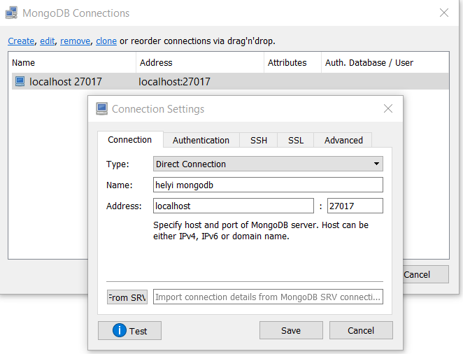
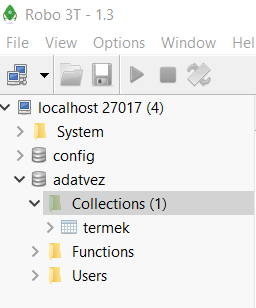

# MongoDB használata

A MongoDB ingyenes, open-source adatbázis kiszolgáló. Mi az un. _community_ változatát használjuk, kliens szoftvernek pedig a _Robo 3T_ alkalmazást.

Letöltési linkek:

- <https://www.mongodb.com/download-center/community>
- <https://robomongo.org/download>

Telepítési útmutató: <https://docs.mongodb.com/manual/administration/install-community/>

!!! example "Eszköz használata videó"
    Az eszköz használatának bemutatása: <https://youtu.be/Xu2af7qPCHI>

## MongoDB szerver elindítása

A telepítési modell függvényében lehet, hogy a MongoDB szerver automatikusan elindul. Ha nem kértük ezt a telepítéskor, akkor a telepítési könyvtárban az alábbi paranccsal tudjuk elindítani a szervert. (Ügyeljünk rá, hogy a szerver a mongo&#8203;**d** exe.)

```bash
mongod.exe --dbpath="<munkakönyvtár>"
```

A _munkakönyvtárban_ fog tárolódni az adatbázis. Ha ilyen módon, konzolból indítottuk a szervert, akkor addig fut, amíg a konzult be nem zárjuk. Leállítani a _Ctrl + C_ billentyűkombinációval kell.

## Mongo shell

A [_Mongo shell_](https://docs.mongodb.com/manual/mongo/) egy egyszerű konzolos kliens alkalmazás. A hivatalos dokumentációban szereplő példák általában ezt használják. Mi nem fogjuk ezt a programot használni.

## Robo 3T

A Robo 3T egy egyszerű és ingyenes kliensprogram MongoDB adatbázis használatához. Létezik több funkcióval rendelkező, fizetős kliensprogram is (Studio 3T), nekünk azonban megfelel az egyszerűbb is.

A program indulásakor kiválaszthatjuk a már korábban létrehozott kapcsolatunkat, vagy készíthetünk egy újat. Alapértelmezésként a helyben futó szervert a `localhost` címen és a `27017` porton érhetjük el.



A sikeres kapcsolódás után az alkalmazás bal oldalán a faszerkezetben látjuk a kapcsolódott kiszolgálót, az adatbázisokat és a gyűjteményeket. Kezdetben se adatbázisunk, se gyűjteményeink nem lesznek. (Ezeket létrehozhatjuk kézzel is: jobb egérrel kattintva a szerver nevén találjuk például a _Create Database_ parancsot. Mi azonban ezt nem használjuk.)



A gyűjtemények tartalmát dupla kattintással tekinthetjük meg. Ez egy új tab fület nyit, ahol is egy keresést végzett a kliens nekünk. Ezt a keresési parancsot lecserélhetjük, átírhatjuk, ha szükségünk van rá.

A gyűjtemény tartalma a parancs alatt található. Egy-egy dokumentum egy-egy sor. A dokumentumot törölni, szerkeszteni a rekordra való jobb egér kattintással tudjuk. A szerkesztés során a JSON dokumentumot szerkesztjük.


Új dokumentumot beszúrni szintén jobb egérrel kattintva tudunk. Itt egy üres szerkesztőt kapunk. Ha új rekordot akarunk létrehozni, célszerű egy meglevő dokumentum JSON-jét lemásolni és úgy hozni létre az újat, hogy a kulcsok nevei biztosan jók legyenek.
