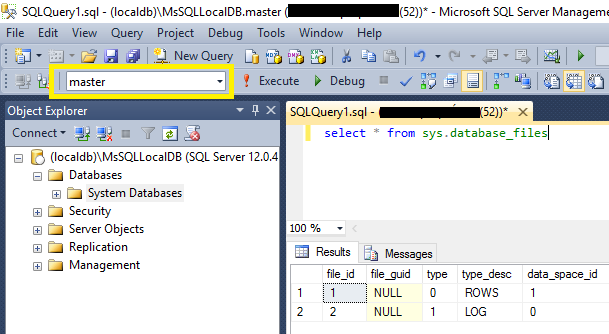
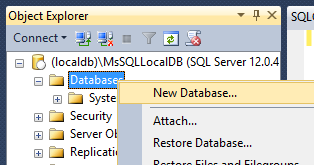
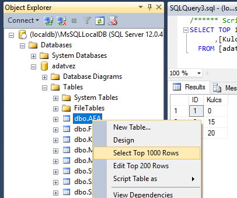
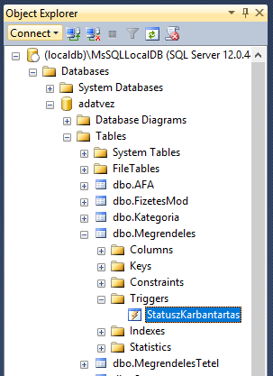

# Using Microsoft SQL Server

Microsoft SQL Server is accessed using SQL Server Management Studio. For development purposes the server runs locally; we are using the so-called LocalDB version, but you can also use the Express edition is (any version).

Download links:

- LocalDB is installed with Visual Studio
- <https://www.microsoft.com/en-us/sql-server/sql-server-editions-express>
- <https://docs.microsoft.com/en-us/sql/ssms/download-sql-server-management-studio-ssms>

!!! example "Video guide of the tools"
    How to use these tools: <https://youtu.be/kK1i_HUujAc>

## Using SQL Server Management Studio

In university computer laboratories you can start the software from the start menu. Connection details are configured when the application starts. When using LocalDB the _Server name_ is `(localdb)\mssqllocaldb`; for Express Edition the name is `.\sqlexpress` (if installed with default settings). Either case use _Windows Authentication_.

When the connection is established, the databases are listed on the left in the _Object Explorer_ window under _Databases_. If there is any existing database, this folder can be expanded, and if there are any tables in the database, those, and other schema items are all listed here.

SQL code can be executed in a new _Query_ window opened using  on the toolbar. The commands in the _Query_ window are executed on the currently selected database; this database is selected from a dropdown in the toolbar (see in the image below with yellow). We can open multiple _Query_ windows.

The SQL command is executed using the  button on the toolbar. If any text is selected, only the selection is executed; otherwise the entire window content is sent to the server. The result and/or errors are printed under the script.

### Creating a new database

If we have no database, we must create one first. In _Object Explorer_ right click _Databases_ to open a dialog. We need to specify a name, and leave all other options as-is. After creating a new database, we shall not forget to select the current database on the toolbar for any _Query_ window we have open!

### Concurrent transactions

In order to simulate concurrent transactions we need two _Query_ windows; open two by pressing the _New Query_ button twice. You can align these windows next to each other by right clicking the _Query_ tab title and selecting _New Vertical Tab Group_.

### Listing and editing table content

To view the content of any database table, open the database in _Object Explorer_, locate the table under _Tables_, then right click and chose _Select Top 1000 Rows_ or _Edit Top 200 Rows_.

### Intellisense reload

Intellisense often does not work in SQL Management Studio query windows. Press Control+Shift+R-t to trigger a reload of Intellisense cache. We also need to use this after creating a new object (e.g. a new stored procedure).

### Creating stored procedures and triggers

We can create new stored procedures or triggers by writing the T-SQL code to create them in a _Query_ window. Once an item with the same name exists, we cannot create it, but have to modify the existing one using the proper command.

Existing stored procedures are listed in _Object Explorer_ under our database in the _Programability/Stored Procedures_ folder. (Newly created items do not appear in the folder, but we have to refresh the folder content by right clicking and choosing _Refresh_.)

Triggers are found in _Object Explorer_ under the table on which they are defined in the _Triggers_ folder (system-level triggers are in the _Programability_ folder under the database itself).

The code of any existing stored procedure or trigger can be opened by locating them (see above), then right clicking and choosing the _Modify_ command. This will open a new _Query_ window with an `alter` command and the current code of the program.
