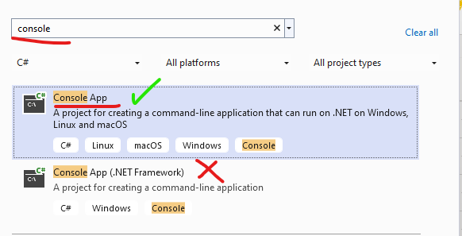
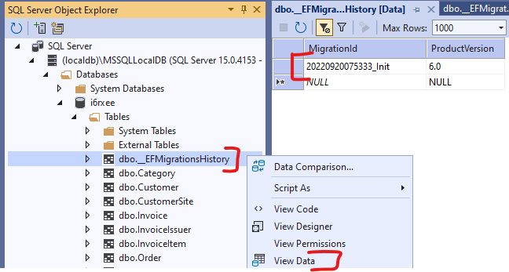

# Entity Framework

A gyakorlat célja, hogy a hallgatók megismerjék a LINQ lekérdezések használatát, valamint az Entity Framework Core ORM keretrendszer alapvető működését.

!!! important "Entity Framework Core"
    A gyakorlat során a .NET 6-ot (régebben .NET Core) és Entity Framework Core 6-ot használjuk, amely már 2016 óta platformfüggetlen, és Linuxos és Mac-en is használható.
    
    A régebbi Entity Framework 6 alapvetően a régebbi .NET Frameworkhöz készült, és ott bevett gyakorlat volt az entitás modellt egy vizuális modell szerkesztő eszközben lehetett karbantartani (EDMX), és ebből C# kódot generálni. Az EF 6-ban az EDMX mellett már támogatott volt a Code-First megközelítés is, ahol EDMX szerkesztés helyett már közvetlenül a C# osztályokat írhattuk. Ezt az EF Core továbbvitte, és most már ez az egyedüli lehetőség (és nem mellesleg kényelmesebb is).
    
    A LINQ lekérdezések tekintetében a két technológia közel azonos élményt nyújt, de apróbb szintaktikai eltérések adódhatnak, illetve az EF Core funkcionálisan már gazdagabb.

## Előfeltételek

A labor elvégzéséhez szükséges eszközök:

- Microsoft Visual Studio 2022
- Microsoft SQL Server (LocalDB vagy Express edition)
- SQL Server Management Studio
- Adatbázis létrehozó script: [mssql.sql](https://raw.githubusercontent.com/bmeviauac01/adatvezerelt/master/docs/db/mssql.sql)

Amit érdemes átnézned:

- C# nyelv
- Entity Framework Core és LINQ

!!! note "Windows mentes fejlesztés"
    A labor alapvetően elvégezhető open-source eszközökkel is (VSCode, .NET 6 SDK, MSSQL Linux alapú verziója akár dockerből), de a labor nem ezeket az eszközöket használja.

## Gyakorlat menete

A gyakorlat végig vezetett, a gyakorlatvezető utasításai szerint haladjunk. Egy-egy részfeladatot próbáljunk meg először önállóan megoldani, utána beszéljük meg a megoldást közösen. Az utolsó feladat opcionális, ha belefér az időbe.

!!! info ""
    Emlékeztetőként a megoldások is megtalálhatóak az útmutatóban is. Előbb azonban próbáljuk magunk megoldani a feladatot!

## Feladat 0: Adatbázis létrehozása, ellenőrzése

Az adatbázis az adott géphez kötött, ezért nem biztos, hogy a korábban létrehozott adatbázis most is létezik. Ezért először ellenőrizzük, és ha nem találjuk, akkor hozzuk létre újra az adatbázist. (Ennek mikéntjét lásd az [első gyakorlat anyagában](../transactions/index.md).)

## Feladat 1: Projekt létrehozása, adatbázis leképzése

Hozz létre Visual Studio segítségével egy C# konzolalkalmazást .NET 6 keretrendszer felett (tehát ne a régi .NET Framework alapút).



Hozd létre a projektet. A `c:\work` mappába dolgozz.

1. Hozzuk létre a kiinduló EF Core Code First modellünket. Ehhez most egy úgynevezett _Reverse Engineering Code First_ megoldást fogunk alkalmazni, aminek a lényege, hogy mivel már van egy kiinduló adatbázisunk abból generálunk egy Code-First modellt, de ezután a továbbiakban Code-First módon dolgozunk.

    - Telepítsük az EF Core alábbi csomagjait a projektbe a NuGet UI-ról (project jobb gomb / Manage NuGet Packages) vagy a projektfájlba másoljuk be a következőt

    ```xml
    <ItemGroup>
        <PackageReference Include="Microsoft.EntityFrameworkCore.SqlServer" Version="6.0.8" />
        <PackageReference Include="Microsoft.EntityFrameworkCore.Design" Version="6.0.8">
            <PrivateAssets>all</PrivateAssets>
            <IncludeAssets>runtime; build; native; contentfiles; analyzers; buildtransitive</IncludeAssets>
        </PackageReference>
        <PackageReference Include="Microsoft.EntityFrameworkCore.Tools" Version="6.0.8">
            <PrivateAssets>all</PrivateAssets>
            <IncludeAssets>runtime; build; native; contentfiles; analyzers; buildtransitive</IncludeAssets>
        </PackageReference>
    </ItemGroup>
    ```

    - Futtassuk le az alábbi EF Core PowerShell parancsot a VS-en belül a _Package Manager Console_-ban, ami legenerálja nekünk az adatbázis kontextust és az entitás modellt:

    ```powershell
    Scaffold-DbContext 'Data Source=(localdb)\MSSQLLocalDB;Initial Catalog=[neptun]' Microsoft.EntityFrameworkCore.SqlServer -Context AdatvezDbContext -OutputDir Entities
    ```

    !!! note "EF Core .NET CLI"
        A továbbiakban is a _Package Manager Console_-ból elérhető paracsokat fogjuk használni, ami egyébként a `Microsoft.EntityFrameworkCore.Tools` csomaggal települ fel. Ha valaki a konvencionális CLI-t szeretné használni VS-en kívül, az alábbi [linken](https://learn.microsoft.com/en-us/ef/core/cli/dotnet) megtalálja a dokumentációt.

2. Vizsgáljuk meg a generált code-first modellt.

    - Az adatbázis elérése az `AdatvezDbContext` osztályon keresztül történik
      - Adatbázis táblák `DbSet` tulajdonságokon keresztül érhetőek el.
      - A kapcsolat konfigurációja az `OnConfiguring` metódusban történik. Éles alkalmazásban ez tipikusan konfigurációs állományból érkezik, ezért is került legenerálásra a `AdatvezDbContext(DbContextOptions<AdatvezDbContext> options)` konstruktor
      - Az adatbázis modell az `OnModelCreating` metódusban került konfigurálásra.

3. Módosítsunk a modellen
   
    Nevezzük át a `CustomerSite` entitás `Customer` navigációs propertyjént `MainCustomer`-re az entitásban és az `OnModelCreating`-ben is. Ez a módosítás az adatbázis sémán nem változtat csupán a code-first modellen.

    ```csharp title="CustomerSite.cs"
    public virtual Customer? MainCustomer { get; set; }
    ```

    ```csharp title="AdatvezDbContext.cs"
    protected override void OnModelCreating(ModelBuilder modelBuilder)
    {
        // ...

        modelBuilder.Entity<CustomerSite>(entity =>
        {
            // ...

            entity.HasOne(d => d.MainCustomer)
                .WithMany(p => p.CustomerSites)
                .HasForeignKey(d => d.CustomerId)
                .HasConstraintName("FK__CustomerS__Custo__32E0915F");
        });

        // ...
    }
    ```

4. Módosítsunk az adatbázis sémán - Migrációk

    Jelenleg a code-first modellünket scaffoldoltuk a meglévő adatbázisból, de nem szeretnénk a továbbiakban database-first megközelítéssel karbantartani a sémát. Helyette használjunk code-first migrációkat az adatbázis séma módosításához.

    - Hozzunk létre egy kiinduló migrációt `Init` néven, ami a kiinduló sémánkat fogja tartalmazni. A _Package Manager Console_-ban adjuk ki a következő parancsot.

        ```powershell
        Add-Migration Init
        ```

    - Próbáljuk meg lefuttatni ezt a migrációt az adatbázison a következő paranccsal.

        ```powershell
        Update-Database
        ```

        Ez értelemszerűen nem sikerül, mert a migrációban lévő utasítások egy üres adatbázishoz képest szeretné migrálni a sémát, viszont nekünk az adatbázisunkban már ez a séma létezik. 
        Az EF egy spoeciális táblában az `__EFMigrationHitory`-ban követi azt, hogy melyik migráció van már érvényesítve az adatbázison.
            
    - Vegyük fel most kézzel ebbe a táblába az `Init` migrációt, amivel jelezzük az EF-nek, hogy ez már lényegében lefutott. Figyeljünk oda a migráció nevére, aminek a dátumot is tartalmaznia kell.

        

    - Módosítsunk az adatbázis sémán a code-first modellünkben.

        - Legyen a `Product` entitásunk `Price` tulajdonsága `double` helyett `decimal`, ami hasznosabb pénzmennyiségek tárolására. Illetve legyen kötelező (nem nullozható).

            ```csharp title="Pruduct.cs"
            public decimal Price { get; set; }
            ```
            
        - Kötelezőséget és az SQL mező pontosságát állítsuk be a `modelBuilder`rel.

            ```csharp title="AdatvezDbContext.cs"
            protected override void OnModelCreating(ModelBuilder modelBuilder)
            {
                // ...

                modelBuilder.Entity<Product>(entity =>
                {
                    // ...

                    entity.Property(e => e.Price).HasPrecision(18, 2).IsRequired();

                    // ...
                }

                // ...
            }
            ```

        - Készítsünk migrációt a változtatásunkról és ellenőrízzük a generált migrációt

            ```powershell
            Add-Migration PruductPriceDecimal
            ```

        - Futtassuk le a migrációt az adatbázison és ellenőrízzük a hatását az adatbázisban

            ```powershell
            Update-Database
            ```

## Feladat 2: Lekérdezések

A leképzett adatmodellen fogalmazd meg az alábbi lekérdezéseket LINQ használatával. Írd ki konzolra az eredményeket.

Debugger segítségével nézd meg, hogy milyen SQL utasítás generálódik: az `IQueryable` típusú változóra húzva az egeret látható a generált SQL, amint az eredményhalmaz iterálása elkezdődik.

1. Listázd azon termékek nevét és raktárkészletét, melyből több mint 30 darab van raktáron!

2. Írj olyan lekérdezést, mely kilistázza azon termékeket, melyből legalább kétszer rendeltek!

3. Készíts olyan lekérdezést, mely kilistázza azokat a megrendeléseket, melyek összértéke több mint 30.000 Ft! Az eredményhalmaz kiírásakor a vevő nevét követően soronként szerepeljenek az egyes tételek (Termék név, mennyiség, nettó ár).

4. Listázd ki a legdrágább termék adatait!

5. Listázd ki azokat a vevő párokat, akiknek ugyanabban a városban van telephelyük. Egy pár csak egyszer szerepeljen a listában.

??? example "Megoldás"

    ```csharp
    using ConsoleApp3.Entities;

    using Microsoft.EntityFrameworkCore;

    Console.WriteLine("***** Második feladat *****");
    using (var db = new AdatvezDbContext())
    {
        // 2.1
        Console.WriteLine("\t2.1:");
        // Query szintaktika
        var productStockQuery = from p in db.Products
                                where p.Stock > 30
                                select p;

        // Fluent / Method Chaining szintaktika
        // var productStockQuery = db.Products.Where(p => p.Stock > 30);

        foreach (var p in productStockQuery)
        {
            Console.WriteLine($"\t\tName={p.Name}\tStock={p.Stock}");
        }

        // 2.2
        Console.WriteLine("\t2.2:");
        var productOrderQuery = db.Products.Where(p => p.OrderItems.Count >= 2);

        // query szintaktika
        //var productOrderQuery = from p in db.Products
        //                        where p.OrderItems.Count >= 2
        //                        select p;

        foreach (var p in productOrderQuery)
        {
            Console.WriteLine($"\t\tName={p.Name}");
        }

        // 2.3
        Console.WriteLine("\t2.3 helytelen megoldás");
        var orderTotalQuery = db.Orders.Where(o => o.OrderItems.Sum(oi => oi.Amount * oi.Price) > 30000);

        // query szintaktika
        //var orderTotalQuery = from o in db.Orders
        //                      where o.OrderItems.Sum(oi => oi.Amount * oi.Price) > 30000
        //                      select o;

        //foreach (var o in orderTotalQuery)
        //{
        //    Console.WriteLine("\t\tName={0}", o.CustomerSite.MainCustomer.Name);
        //    foreach (var oi in o.OrderItems)
        //    {
        //        Console.WriteLine($"\t\t\tProduct={oi.Product.Name}\tPrice={oi.Price}\tAmount={oi.Amount}");
        //    }
        //}

        // 2.3 második megoldás
        // Exptession alapú Include-hoz szükség van a következő névtér importálására: (CTRL + . is felajánlja a használat során)
        // using Microsoft.EntityFrameworkCore;

        // Csak egy lekérdezést fog generálni, a Navigation Propertyket is feltölti rögtön
        Console.WriteLine("\tc 2.3 helyes megoldás:");
        var orderTotalQuery2 = db.Orders
            .Include(o => o.OrderItems)
                .ThenInclude(oi => oi.Product)
            .Include(o => o.CustomerSite)
            .Include(o => o.CustomerSite.MainCustomer)
            .Where(o => o.OrderItems.Sum(oi => oi.Amount * oi.Price) > 30000);

        // query szintaktika
        //var orderTotalQuery2 = from o in db.Orders
        //                       .Include(o => o.OrderItems)
        //                           .ThenInclude(oi => oi.Product)
        //                       .Include(o => o.CustomerSite)
        //                       .Include(o => o.CustomerSite.MainCustomer)
        //                   where o.OrderItems.Sum(oi => oi.Amount * oi.Price) > 30000
        //                   select o;

        foreach (var o in orderTotalQuery2)
        {
            Console.WriteLine("\t\tName={0}", o.CustomerSite.MainCustomer.Name);
            foreach (var oi in o.OrderItems)
            {
                Console.WriteLine($"\t\t\tProduct={oi.Product.Name}\tPrice={oi.Price}\tAmount={oi.Amount}");
            }
        }

        // 2.4
        Console.WriteLine("\t2.4:");
        var maxPriceQuery = db.Products.Where(p => p.Price == db.Products.Max(a => a.Price));

        // query szintaktika
        //var maxPriceQuery = from p in db.Products
        //                    where p.Price == db.Products.Max(a => a.Price)
        //                    select p;

        foreach (var t in maxPriceQuery)
        {
            Console.WriteLine($"\t\tName={t.Name}\tPrice={t.Price}");
        }

        // 2.5
        Console.WriteLine("\t2.5:");
        var cityJoinQuery = db.CustomerSites
            .Join(db.CustomerSites, s1 => s1.City, s2 => s2.City, (s1, s2) => new { s1, s2 })
            .Where(x => x.s1.CustomerId > x.s2.CustomerId)
            .Select(x => new { c1 = x.s1.MainCustomer, c2 = x.s2.MainCustomer });

        // query szintaktika
        //var cityJoinQuery = from s1 in db.CustomerSites
        //                    join s2 in db.CustomerSites on s1.City equals s2.City
        //                    where s1.CustomerId > s2.CustomerId
        //                    select new { c1 = s1.MainCustomer, c2 = s2.MainCustomer };

        foreach (var v in cityJoinQuery)
        {
            Console.WriteLine($"\t\tCustomer 1={v.c1.Name}\tCustomer 2={v.c2.Name}");
        }
    }
    ```

## Feladat 3: Adatmódosítások

A `DbContext` nem csak lekérdezéshez használható, hanem rajta keresztül beszúrások, módosítások és törlések is végrehajthatóak.

1. Írj olyan LINQ-ra épülő C# kódot, amely az "LEGO" kategóriás termékek árát megemeli 10 százalékkal!

1. Hozz létre egy új kategóriát _Expensive toys_ néven, és sorold át ide az összes olyan terméket, melynek ára, nagyobb, mint 8000 Ft!

??? example "Megoldás"

    ```csharp
    Console.WriteLine("***** Harmadik feladat *****");
    using (var db = new AdatvezDbContext())
    {
        // 3.1
        Console.WriteLine("\t3.1:");
        var legoProductsQiery = db.Products.Where(p => p.Category.Name == "LEGO");

        Console.WriteLine("\tMódosítás előtt:");
        foreach (var p in legoProductsQiery.ToList())
        {
            Console.WriteLine($"\t\t\tName={p.Name}\tStock={p.Stock}\tPrice={p.Price}");
            p.Price = 1.1m * p.Price;
        }

        db.SaveChanges();

        Console.WriteLine("\tMódosítás után:");
        // A ToList adatbázis kérést indukál
        foreach (var p in legoProductsQiery.ToList())
        {
            Console.WriteLine($"\t\t\tName={p.Name}\tStock={p.Stock}\tPrice={p.Price}");
        }

        // 3.2
        Console.WriteLine("\t3.2:");
        var expensiveToysCategory = db.Categories
            .Where(c => c.Name == "Expensive Toys")
            .SingleOrDefault();

        if (expensiveToysCategory == null)
        {
            expensiveToysCategory = new Category { Name = "Expensive toys" };

            // Erre nem feltetlenul van szukseg: ha van atrendelt termek, ahhoz hozzakotjuk a kategoria entitast
            // es bekerul automatikusan a kategoria tablaba is. Igy viszont, hogy explicit felvesszuk, (1) jobban
            // kifejezi a szandekunkat; es (2) akkor is felvesszuk a kategoriat, ha vegul nincs atrendelt termek.
            db.Categories.Add(expensiveToysCategory);
        }

        var expensiveProductsQuery = db.Products.Where(p => p.Price > 8000);

        foreach (var p in expensiveProductsQuery.ToList())
        {
            p.Category = expensiveToysCategory;
        }

        db.SaveChanges();

        expensiveProductsQuery = db.Products
            .Include(p => p.Category)
            .Where(p => p.Category.Name == "Expensive toys");

        foreach (var p in expensiveProductsQuery)
        {
            Console.WriteLine($"\t\tName={p.Name}\tPrice={p.Price}\tCategory={p.Category.Name}");
        }
    }
    ```

## Feladat 4: Tárolt eljárások használata

Készíts egy tárolt eljárást egy új code first migráción keresztül, amely kilistázza azon termékeket melyből legalább egy megadott darabszám felett adtak el. Hívd meg a tárolt eljárást C# kódból!

1. Készítsd egy új üres migrációt `PopularProducts_SP` néven.

    ```powershell
    Add-Migration PopularProducts_SP
    ```

2. Hozd létre a tárolt eljárást az alábbi kóddal. A vissza irányú migráció megírásától most tekintsünk el, ahol egyébként törölni kellene a tárolt eljárást.

    ```csharp
    public partial class PopularProducts_SP : Migration
    {
        protected override void Up(MigrationBuilder migrationBuilder)
        {
            migrationBuilder.Sql(
    @"CREATE OR ALTER PROCEDURE dbo.PopularProducts (@MinAmount int = 10)
    AS
    SELECT Product.* 
    FROM Product 
    INNER JOIN
    (
        SELECT OrderItem.ProductID
        FROM OrderItem
        GROUP BY OrderItem.ProductID
        HAVING SUM(OrderItem.Amount) > @MinAmount
    ) a ON Product.ID = a.ProductID");
        }

        protected override void Down(MigrationBuilder migrationBuilder)
        {
        }
    }
    ```

3. Frissítsd az adatbázist és ellenőrízd az eredményét!

    ```powershell
    Update-Database
    ```

4. Hívd meg a tárolt eljárást a kontextus `Product` `DbSet`-jéről indulva a `FromSqlInterpolated` vagy `FromSqlRaw` metódusokkal

    ??? example "Megoldás"

        ```csharp
        Console.WriteLine("***** Negyedik feladat *****");
        using (var db = new AdatvezDbContext())
        {
            var popularProducts = db.Products.FromSqlInterpolated($"EXECUTE dbo.PopularProducts @MinAmount={5}");
            foreach (var p in popularProducts)
            {
                Console.WriteLine($"\tName={p.Name}\tStock={p.Stock}\tPrice={p.Price}");
            }
        }
        ```

    !!! danger "`FromSqlInterpolated` vs. `FromSqlRaw`"
        A fenti megoldásban a `FromSqlInterpolated` függvénnyel kerül definiálásra a hívás, ahol a nevéből is adódóan az interpolálandó stringet még az EF feldolgozza és az interpolációt nem hagyományosan stringként végzi el, hanem `SqlParameter`eket helyettesít be az SQL injection elleni védelem érdekében.

        Ezzel szemben a `FromSqlraw` függvény használata során **tilos** string interpolációt használni, helyette nekünk kézzel kell az `SqlParameter`eket létrehozni és placeholdereket definiálni az utasításban
